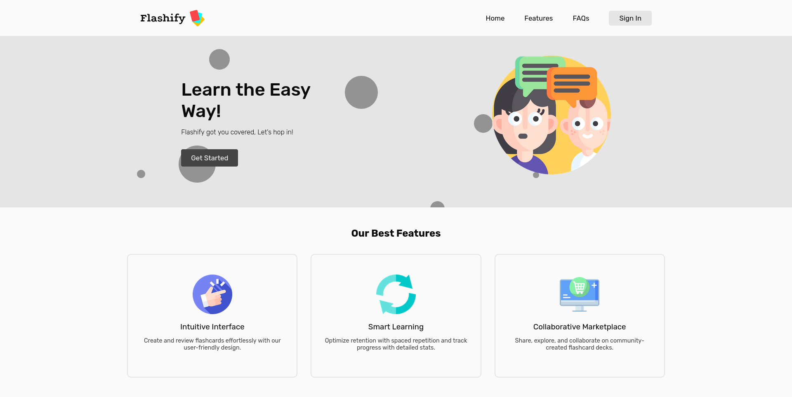

# Flashify

Flashify is a minimal, beautiful, and responsive web-based flashcard application built using the LAMP stack as part of a college mini-project.



## Features

- Organizes content with decks, cards, and favorites
- Implements spaced repetition and active recall techniques for effective learning
- Orders cards based on past review sessions for optimized studying
- Enforces a one-hour delay between deck reviews to enhance retention
- Provides a GitHub-like activity chart to track daily card review progress
- Offers a marketplace for users to share and clone decks
- Allows users to publish their decks to the marketplace
- Includes a "like" system for public decks to help users find popular content
- Supports import and export of decks as CSV files for easy backup and cross sharing

## Run Locally

### Via Docker

The easiest way to run this project locally is with Docker and Docker Compose.

#### Prerequisites

1. Ensure Docker and Docker Compose are installed on your system.

#### Setup

1. Copy `.env.example` to `.env` and set up the database credentials.
2. Copy `SECRETS.php.example` to `SECRETS.php` (no need to edit, leave as is).

#### Run the Application

1. Open a terminal and navigate to the project directory.
2. Run the following command:

   ```bash
   sudo docker-compose -f docker-compose.prod.yml up
   ```
   Note: This configuration doesn't include PHPMyAdmin, to have access to it. Run `docker-compose` with `docker-compose.dev.yml`. 

#### Access the Application

- Main application:

  - If running locally: http://localhost
  - If running on a server: Use the server's IP address

### Run Locally Without Docker

These steps are for Debian-based systems, but the overall procedure is similar for any Linux distribution.

#### Prerequisites

1. **Setup Apache, PHP, and MySQL (or MariaDB)**
   - Ensure you have Apache, PHP, and MySQL installed on your system.

#### Installation Steps

1. **Clone the repository**

   ```bash
   git clone https://github.com/shonebinu/flashify.git /var/www/flashify
   ```

2. **Configure MySQL connection**

   - Copy `SECRETS.php.example` to `SECRETS.php`
   - Open `SECRETS.php` and insert your MySQL connection details (host, user, password, database)

3. **Import database schema**

   - Import the `db.sql` file via phpMyAdmin or using the MySQL command line:
     ```bash
     mysql -u your_username -p your_database_name < /path/to/db.sql
     ```

4. **Setup Apache Virtual Host**

   a. Create a new configuration file:

   ```bash
   sudo vim /etc/apache2/sites-available/flashify.conf
   ```

   b. Add the following content (adjust as needed):

   ```apache
   <VirtualHost *:80>
       ServerAdmin webmaster@flashify.local
       ServerName flashify.local
       DocumentRoot /var/www/flashify

       <Directory /var/www/flashify>
           AllowOverride All
           Require all granted
       </Directory>

       ErrorLog ${APACHE_LOG_DIR}/flashify_error.log
       CustomLog ${APACHE_LOG_DIR}/flashify_access.log combined
   </VirtualHost>
   ```

   c. Enable mod_rewrite:

   ```bash
   sudo a2enmod rewrite
   ```

   d. Enable the new virtual host:

   ```bash
   sudo a2ensite flashify.conf
   ```

   e. Reload Apache:

   ```bash
   sudo service apache2 reload
   ```

5. **Configure local domain (optional)**
   - Add an entry to your `/etc/hosts` file:
     ```bash
     sudo vim /etc/hosts
     ```
   - Add the following line:
     ```
     127.0.0.1 flashify.local
     ```

#### Accessing the Application

Open a web browser and navigate to `http://flashify.local` or `http://localhost`, depending on your configuration.
